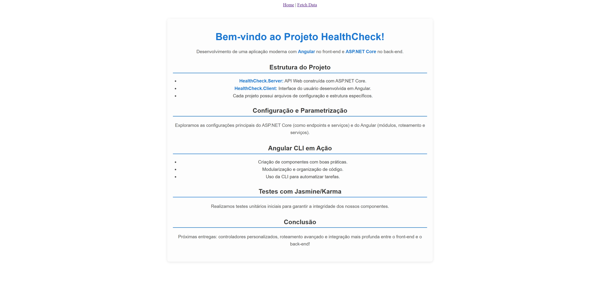
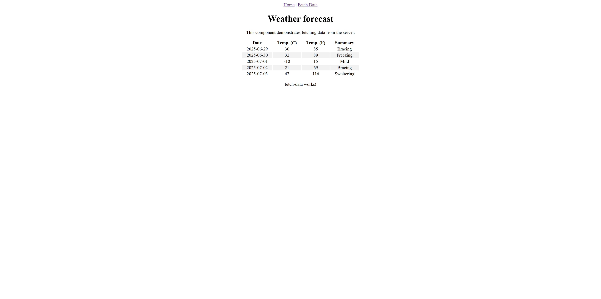
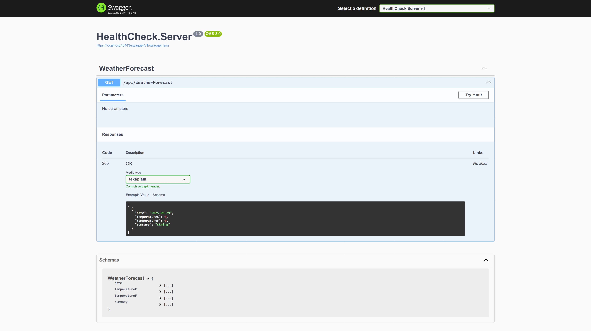
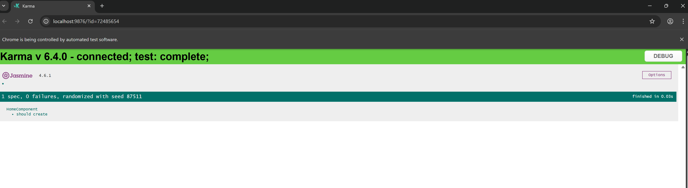

# HealthCheck App

Aplicação full-stack desenvolvida com **Angular** no front-end e **ASP.NET Core** no back-end. Criada como projeto de estudo e referência prática para construção de aplicações modernas com foco em arquitetura limpa, testes, modularização e integração eficaz entre front e back-end.

## Tecnologias Utilizadas

- **Front-end**: Angular 17+, TypeScript, Angular CLI
- **Back-end**: ASP.NET Core 8, Web API, C#
- **Testes**: Jasmine, Karma
- **Ferramentas**: Visual Studio, VS Code, Swagger, Postman

## O que foi aprendido até agora

- Estrutura e configuração de projetos Angular e ASP.NET Core
- Criação de componentes via Angular CLI
- Definição e customização de módulos e rotas
- Configuração de serviços e injeção de dependências
- Roteamento e comunicação entre front-end e API
- Testes unitários com Jasmine/Karma
- Configuração de endpoints com ASP.NET Core

## Funcionalidades (em progresso)

- [x] Estruturação inicial do projeto
- [x] Página inicial descritiva com Angular
- [x] Configuração de serviços e rotas
- [x] Componentes criados com CLI
- [ ] Integração completa front-end ↔ back-end
- [ ] Controladores customizados
- [ ] Estratégias avançadas de roteamento
- [ ] Testes de integração

## Telas

### <https://localhost:4200/>

### <https://localhost:4200/fetch-data>

### <https://localhost:40443/swagger/index.html>

### Teste com Jasmine/Karma

> ng test

## Observação

Este projeto é didático e pode servir como base para aplicações futuras mais robustas e especializadas.
